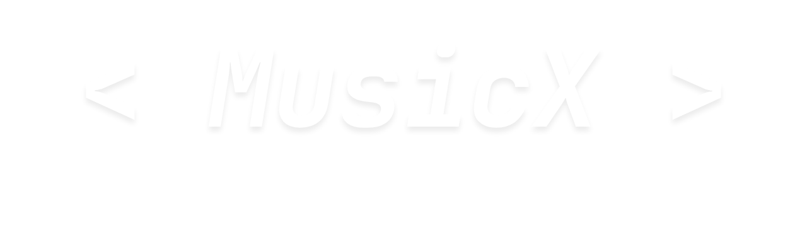

  

  

# MusicX

### Offline Music Player for Android

No ads • No subscriptions • No accounts

## ❯ WHY I MADE MUSICX

I got tired of music apps stuffing everything behind subscriptions, ads, and features nobody asked for.

MusicX is built around one idea:

**Your music should stay yours.**

Import your songs, organize your library, make playlists, and listen offline without getting nagged to upgrade.

## ❯ FEATURES

### Available

- Offline Playback
- Lyrics Support
- Local Music Library
- Search
- Playlists
- Theme Customization
- Music Importing
- Background Playback
- Media Controls

### Planned

- Animated Splash Screen
- Better Folder Management
- Duplicate Song Detection
- Audio Enhancements

## ❯ CURRENT PROGRESS

| Component | Status |
|-----------|----------|
| Playback System | ✅ Complete |
| Navigation | ✅ Complete |
| Settings UI | 🚧 In Progress |
| Theme Engine | 🚧 In Progress |
| Library Scanner | 🚧 In Progress |
| Playlists | 🚧 In Progress |
| Search | 🚧 In Progress |
| Splash Animation | ⏳ Planned |

## ❯ TECH STACK

| Category | Technology |
|-----------|-----------|
| Language | Kotlin |
| UI | Jetpack Compose |
| Architecture | MVVM |
| Storage | DataStore |
| Database | Room |
| Playback | Media3 |

  

<h2>❯ Support MusicX</h2>

MusicX will never have ads. 
Never have subscriptions. 
Never lock features behind paywalls.

If you want to help keep it that way —

  

<svg width="160" height="10">
  <rect width="160" height="2" y="4" fill="#0d0d0d">
    <animate attributeName="width" values="0;160;0" dur="2.5s" repeatCount="indefinite" />
  </rect>
</svg>

## &lt; MusicX &gt;

  

