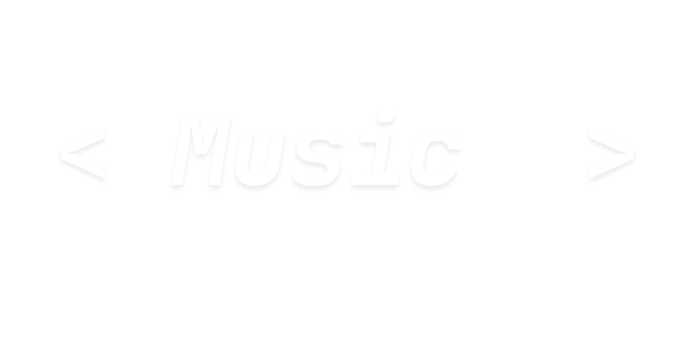

  

 

<h1 align="center">🎵 MusicX</h1>

<h3 align="center">
Fast • Offline • Free
</h3>

MusicX is an Android music player focused on speed, customization, and offline listening.
 
No ads. No subscriptions. No locked features.

 

## ⚡ Why MusicX?

<table>
<tr>
<td align="center" width="25%">

### 🚫
### No Ads

</td>

<td align="center" width="25%">

### 🔓
### No Premium

</td>

<td align="center" width="25%">

### 📶
### Offline First

</td>

<td align="center" width="25%">

### ⚡
### Fast

</td>
</tr>
</table>

---

## 🚀 Features

<table>
<tr>

<td width="50%" valign="top">

### Current

- Offline Playback
- Local Library
- Playlists
- Search
- Theme Customization
- Import Music
- Media Controls

</td>

<td width="50%" valign="top">

### Planned

- Lyrics Support
- Animated Splash Screen
- Folder Management
- Duplicate Detection
- Audio Enhancements
- More Customization

</td>

</tr>
</table>

---

## 📊 Development Progress

### Playback System

<progress value="100" max="100"></progress>

### Navigation

<progress value="100" max="100"></progress>

### Settings UI

<progress value="90" max="100"></progress>

### Theme Engine

<progress value="90" max="100"></progress>

### Library Scanner

<progress value="80" max="100"></progress>

### Playlists

<progress value="70" max="100"></progress>

### Search

<progress value="70" max="100"></progress>

### Splash Animation

<progress value="50" max="100"></progress>

---

## 🛠 Tech Stack

 

 

<table>
<tr>
<td>

### Language

Kotlin

</td>
<td>

### UI

Jetpack Compose

</td>
<td>

### Architecture

MVVM

</td>
</tr>

<tr>
<td>

### Storage

DataStore

</td>
<td>

### Database

Room

</td>
<td>

### Playback

Media3

</td>
</tr>
</table>

---

## 🎨 Design Philosophy

<table>
<tr>
<td width="50%">

### ✅ MusicX

- Pure Black UI
- White Text
- Minimal Layout
- Fast Performance
- User Customization

</td>

<td width="50%">

### ❌ Not MusicX

- Ads
- Paywalls
- Clutter
- Forced Accounts
- Premium Features

</td>
</tr>
</table>

---

<b>📂 Project Goals</b>

 

- Build a modern offline music player
- Keep every feature free
- Focus on speed
- Focus on reliability
- Allow deep customization
- Never require subscriptions

---

## 📅 Roadmap

| Status | Feature |
|----------|----------|
| ✅ | Core Navigation |
| ✅ | Settings System |
| ✅ | Theme Engine |
| 🚧 | Library Scanner |
| 🚧 | Playlists |
| 🚧 | Search |
| ⏳ | Splash Animation |
| ⏳ | Public Beta |

---

<h2>🎵 MusicX</h2>

Offline Music. 
No Nonsense.

