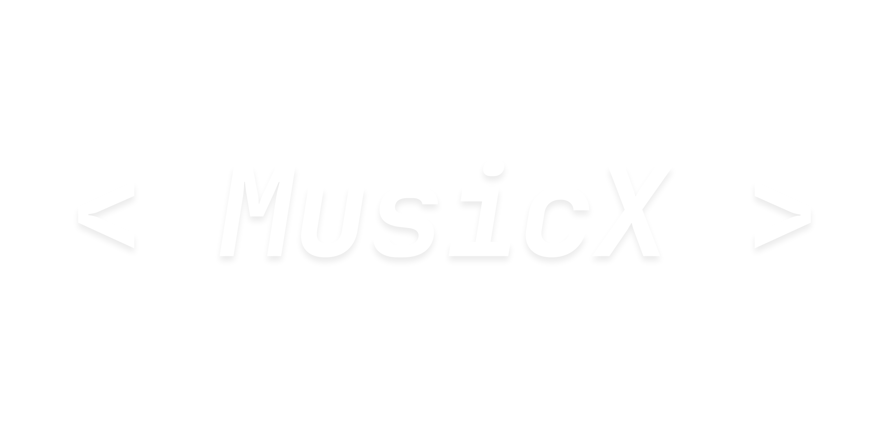

<picture>
  <source media="(prefers-color-scheme: dark)" srcset="./assets/MusicX_Banner.png">
  
</picture>

  <a href="https://git.io/typing-svg">
    <picture>
      <source media="(prefers-color-scheme: dark)" srcset="https://readme-typing-svg.demolab.com?font=Share+tech+mono&size=26&pause=1000&color=ffffff&center=true&vCenter=true&width=550&lines=MusicX+-+Offline+Music+Player;Completely+Ad-Free;No+subscriptions;No+paywalls+stalking+you+(%E2%89%96+-+%E2%89%96)">
      
    </picture>
  </a>

<a href="https://github.com/yummyfiles/MusicX/releases/latest">
  <picture>
    <source media="(prefers-color-scheme: dark)" srcset="https://img.shields.io/badge/DOWNLOAD_APK-000000?style=for-the-badge&logo=android&logoColor=white&labelColor=000000&color=000000">
    
  </picture>
</a>

<a href="https://yummyfiles.vercel.app/projects/musicx">
  <picture>
    <source media="(prefers-color-scheme: dark)" srcset="https://img.shields.io/badge/PROJECT_HUB-000000?style=for-the-badge&logo=gitbook&logoColor=white&labelColor=000000&color=000000">
    
  </picture>
</a>

  

# MusicX

### Offline Music Player for Android

No ads • No subscriptions • No accounts  
No “Start Free Trial” button stalking you 😭

---

---

> [!CAUTION]
> **Keep Android Open**
>
> MusicX supports open-source Android and user freedom.  
> No lock-ins. No forced services. No platform control.  
>
> Learn more: https://keepandroidopen.org

---

> **[Project Hub](https://yummyfiles.vercel.app/projects/musicx)** — Documentation, wiki, guides, and everything you need to know about MusicX.

---

## ❯ WHY I MADE MUSICX

I got tired of music apps stuffing everything behind subscriptions, ads, and features nobody asked for.

MusicX is built around one idea:

**Your music should stay yours.**

Import your songs, organize your library, make playlists, and listen offline without getting nagged to upgrade.

---

## ❯ FEATURES

### Available

- Offline Playback
- Lyrics Support
- Local Music Library
- Search
- Playlists
- Theme Customization
- Music Importing
- Background Playback
- Media Controls

---

## ❯ TECH STACK

| Category | Technology |
|-----------|-----------|
| Language | Kotlin |
| UI | Jetpack Compose |
| Architecture | MVVM |
| Storage | DataStore |
| Database | Room |
| Playback | Media3 |

---

## ❯ MUSICX

  

